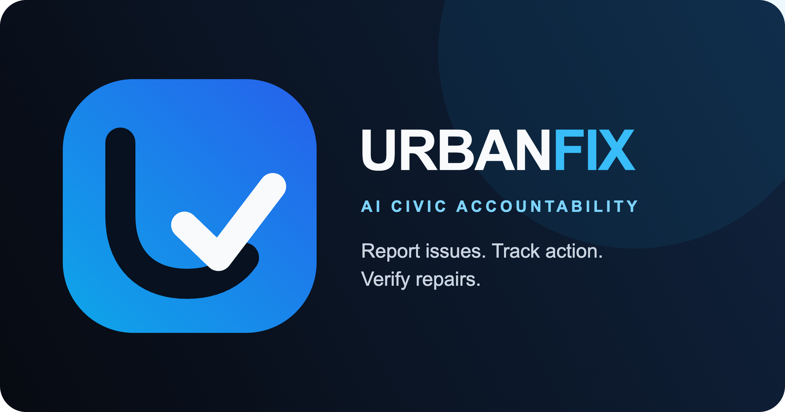

# UrbanFix AI



**Turn a citizen's photo and location into prioritized, trackable civic action.**

UrbanFix AI is an evidence-backed civic reporting and decision-support platform. Citizens report problems, AI structures the evidence, a transparent rules engine prioritizes work, and authorities coordinate verified contractors or eligible community micro-maintenance through completion.

> Hackathon submission status: functional full-stack MVP with automated frontend, backend, and responsive browser tests.

## Why it stands out

- **Action, not just reporting:** complaints move through assignment, proof, approval, and closure.
- **Explainable prioritization:** AI recommends a classification; deterministic scoring controls priority.
- **Public accountability:** receipts expose SLA state, evidence hashes, approvals, and a tamper-evident audit chain without revealing reporter identity.
- **Resilient demo:** seeded in-memory data keeps local demos working when MongoDB or external AI is unavailable.
- **Safety by design:** metadata stripping, PII screening, role-based access, CSRF protection, upload validation, and production configuration checks are built in.

## Demo flow

1. A citizen uploads a photo and confirms its location from EXIF, device GPS, a map pin, or an address.
2. AI recommends category, severity, department, confidence, and a short summary.
3. The priority engine calculates a transparent score and places the issue on the authority dashboard.
4. An administrator assigns an eligible contractor or reviews a low-risk community proposal.
5. The worker submits evidence; authority approval releases payment through the configured provider.
6. The citizen follows progress using the public complaint ID and accountability receipt.

For a presentation-ready walkthrough, use [the 90-second demo script](docs/DEMO_SCRIPT.md).

## Architecture

```text
React + Vite client
        │ same-origin /api
        ▼
FastAPI application ── Gemini analysis
        │              Cloudinary evidence
        │              Stripe payments
        ▼
MongoDB repository (seeded memory fallback in development)
```

The backend keeps AI recommendations separate from deterministic workflow and priority decisions. See the [API contract](docs/API_CONTRACT.md), [project structure](docs/PROJECT_STRUCTURE.md), and [engineering review](docs/ENGINEERING_REVIEW.md) for implementation detail.

## Tech stack

| Layer | Technology |
| --- | --- |
| Frontend | React 19, Vite, Tailwind CSS, Leaflet |
| API | FastAPI, Pydantic |
| Data | MongoDB via Motor; in-memory demo fallback |
| Integrations | Gemini, Cloudinary, Stripe |
| Quality | Vitest, Testing Library, Pytest, Playwright |
| Deployment | Vercel, Docker, Render |

## Run locally

Prerequisites: Node.js 22+, Python 3.12+, and optionally MongoDB.

```bash
git clone https://github.com/asadali552/CivicPulse.git
cd CivicPulse
npm ci

python3 -m venv backend/.venv
backend/.venv/bin/pip install -r backend/requirements.txt
cp backend/.env.example backend/.env

npm run build
./scripts/run_backend.sh
```

Open <http://127.0.0.1:8000>. API documentation is at <http://127.0.0.1:8000/docs> and the health endpoint at <http://127.0.0.1:8000/api/health>.

The temporary judge administrator is `admin` / `admin`, also shown in the authority portal. After judging, set `ALLOW_DEMO_ADMIN=false` and replace both credentials. MongoDB is optional locally because `ALLOW_MEMORY_FALLBACK=true` enables seeded, non-persistent demo data.

For frontend hot reload, run `npm run dev` in a second terminal. Vite proxies `/api` and `/uploads` to FastAPI on port 8000.

## Configuration

Copy [`backend/.env.example`](backend/.env.example) to `backend/.env`. The template is safe to commit and contains no credentials.

- `GEMINI_API_KEY` enables live AI analysis; the demo remains usable without it.
- `MONGO_URI` enables persistent storage.
- `CLOUDINARY_*` configures production evidence storage.
- `PAYMENT_PROVIDER=stripe` and `STRIPE_SECRET_KEY` enable production payment release.

Never commit `.env`; it is ignored by Git. `ALLOW_DEMO_ADMIN=true` temporarily permits the published judge login; disable it and rotate the credentials immediately after judging.

## Quality checks

```bash
npm test
npm run build
backend/.venv/bin/pytest -q backend/tests
npx playwright install chromium   # first run only
npm run test:e2e
```

GitHub Actions runs the same frontend build, unit tests, backend tests, and responsive Playwright checks for every push and pull request.

## Deployment

### Vercel

Import the repository with its root as the project root. Vercel uses `index.py` for FastAPI and serves the compiled client and `/api` from the same domain.

Set at least these production variables:

```text
ENVIRONMENT=production
ALLOW_MEMORY_FALLBACK=false
SEED_DEMO_DATA=false
MONGO_URI=<MongoDB Atlas connection string>
MONGO_DB_NAME=<database name>
ADMIN_USERNAME=<secure administrator name>
ADMIN_PASSWORD=<at least 12 characters>
ALLOW_DEMO_ADMIN=false
REPORTER_TOKEN_SECRET=<random value of at least 32 characters>
CLOUDINARY_URL=<Cloudinary connection URL>
PAYMENT_PROVIDER=stripe
STRIPE_SECRET_KEY=<Stripe secret key>
PUBLIC_BASE_URL=<deployed HTTPS URL>
GEMINI_API_KEY=<optional Gemini API key>
```

Use either `CLOUDINARY_URL` or the three separate `CLOUDINARY_*` values. Production refuses unsafe configuration instead of silently falling back to non-persistent storage.

The included `Dockerfile` and `render.yaml` support a single-service Render deployment. More detail is in [deployment notes](deploy/DEPLOYMENT_NOTES.md).

## Security and project boundaries

- Reporter contact details are protected by time-limited verification tokens.
- Uploaded images are decoded, pixel-limited, orientation-normalized, metadata-stripped, and re-encoded.
- Public text is screened for common phone, email, and national-identifier patterns; public coordinates use reduced precision.
- Community work is limited to explicitly eligible, low-risk cleanup and beautification tasks.
- Stripe transfers use one idempotency key per work order, and MongoDB production workflows require transaction support.

Please report vulnerabilities privately as described in [SECURITY.md](SECURITY.md). Contributions are welcome through [CONTRIBUTING.md](CONTRIBUTING.md).

## Team

UrbanFix AI is a hackathon project maintained by [@asadali552](https://github.com/asadali552). Contributions and feedback are welcome.

## License

Released under the [MIT License](LICENSE).
